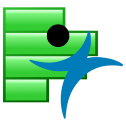

## My story

I am a student pursuing my Master of IT in Business at Singapore Management University. Graduating with a bachelor in Mechanical Engineering, I am embarking on a new journey into the Data Science industry. As an aspiring Data Scientist, I want to utilize my analytical acumen to find solutions and translate them into actionable insights using data.

## Some of the tools I Use:

### Python Programming

### R Programming

### SQL (Structured Query Language)

### JMP Pro, SAS

### SAS Enterprise Miner

### Tableau, BI Visualization tool

